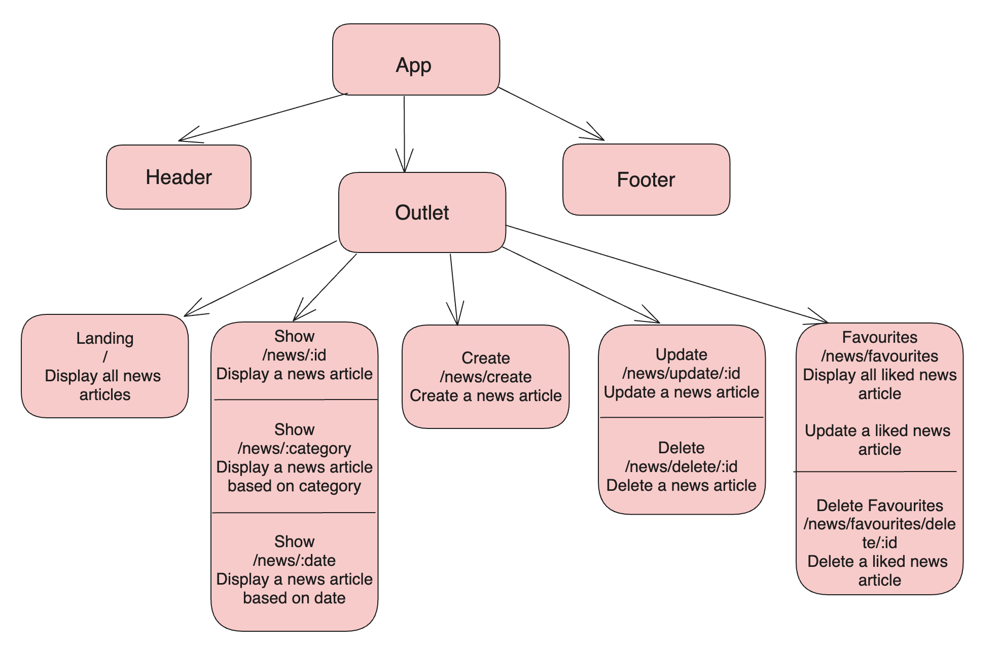
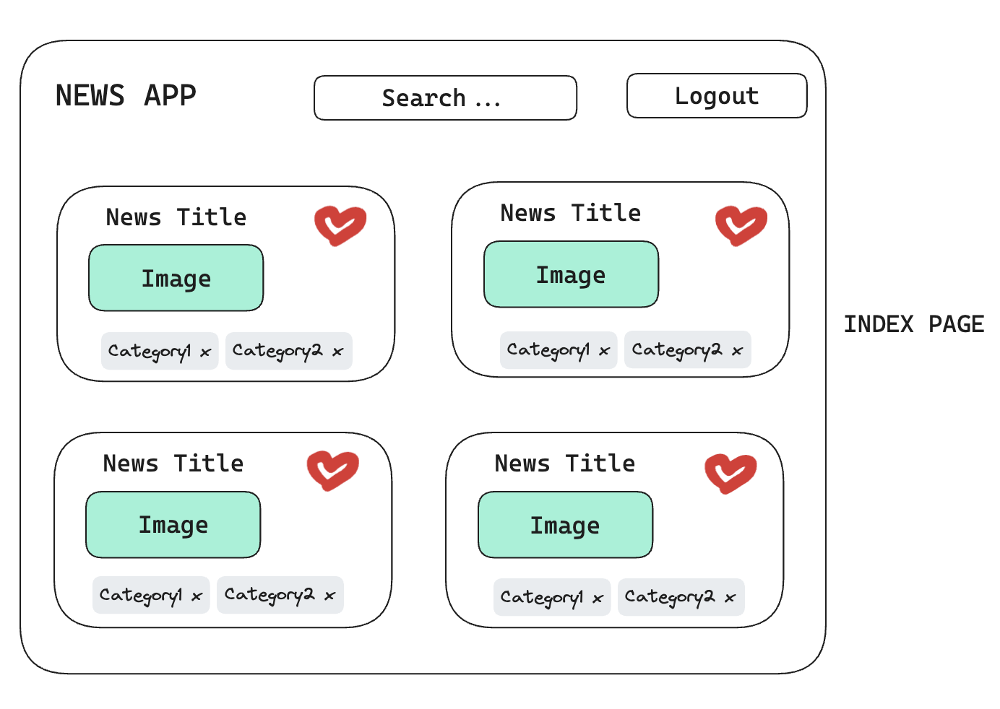
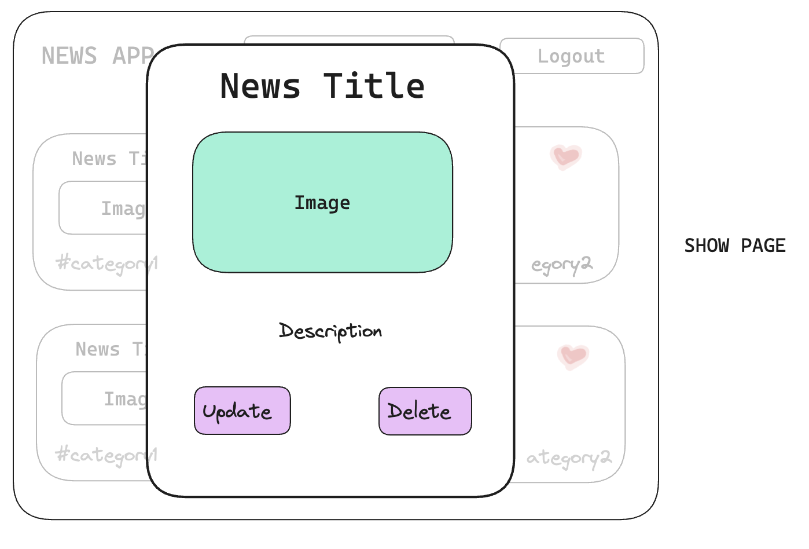
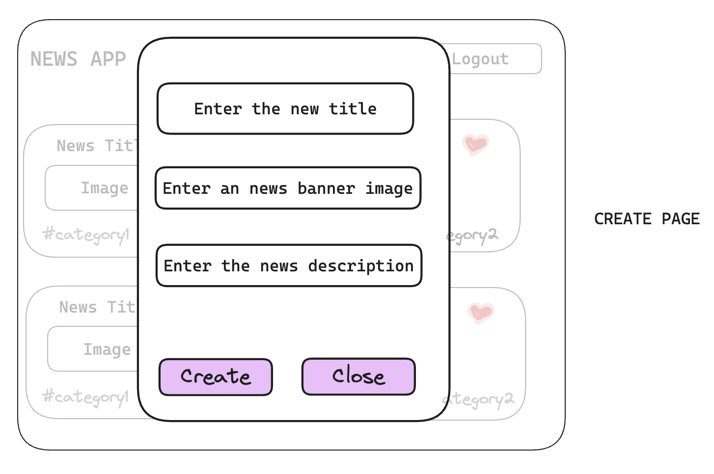
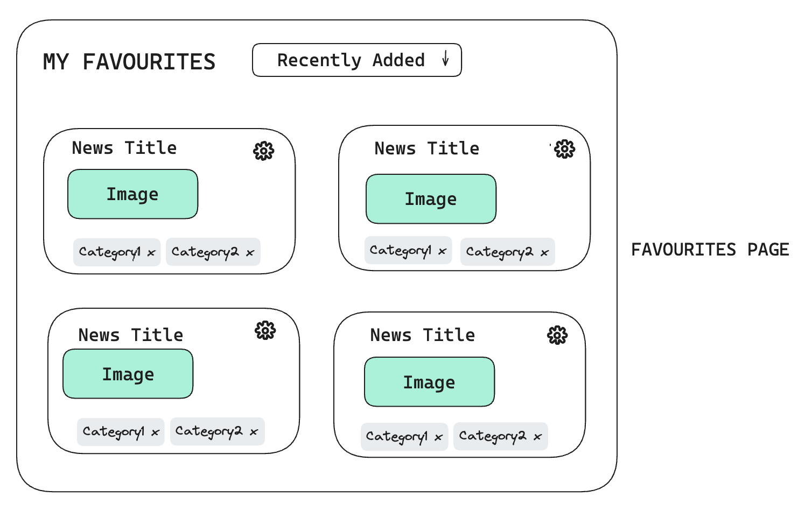
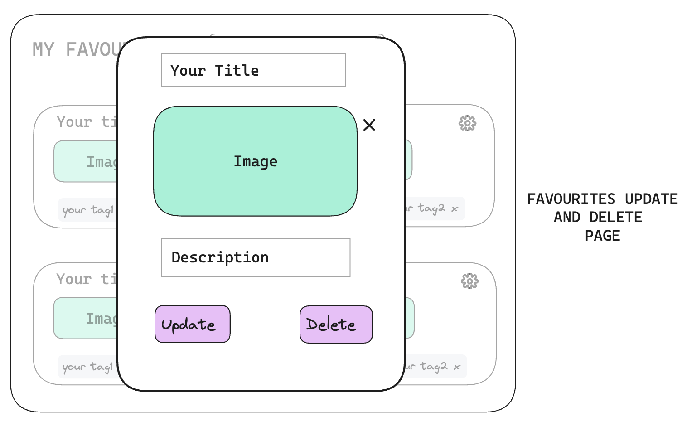

# Description

- **App Name:** Personalized News App
- **Description:** An app to get news based on user preference and interest.
- **Github URL:**  https://github.com/amritadutta25/Personalized_News_app_frontend
- **Deployed Website:** 

# Problem Being Solved and Target Market
To create a news outlet to let usres get news articles based on their interest and preferences without having to filter out news manually.

## List of React Router Routes

| Route Name | Endpoint | Method | Description | 
|------------|----------|--------|-------------|
| Landing | / | GET | Renders all news article on a page|
| NewsShow | /news/:id | GET | Renders a news article |
| NewsCategoryShow | /news/:category | GET | Renders multiple news article based on category|
| NewsDateShow | /news/:date | GET | Renders multiple news article based on date|
| NewsCreate | /news/create | POST | Creates a news article |
| NewsDelete | /news/delete/:id | DELETE | Deletes a session |
| NewsEdit | /news/update/:id | PUT | Updates a news article|
| NewsFavourites | /news/favourites | GET | Shows all liked news article with option to update articles from the list |
| NewsFavouritesCreate | /news/favourites/create | POST | Adds a news article  to favourite list|
| NewsFavouritesEdit | /news/favorites/edit/:id | PUT | Updates tags, title of news article in the favourite list|
| NewsFavouritesDelete | /news/favorites/delete/:id | DELETE | Deletes articles from the list |

## React Architecture (Expected Tree of React Components)

## Mockups
News Index page

News Show, Update, Delete page

News Create page

Favourites Index page

Favourites Show, Update, Delete page
